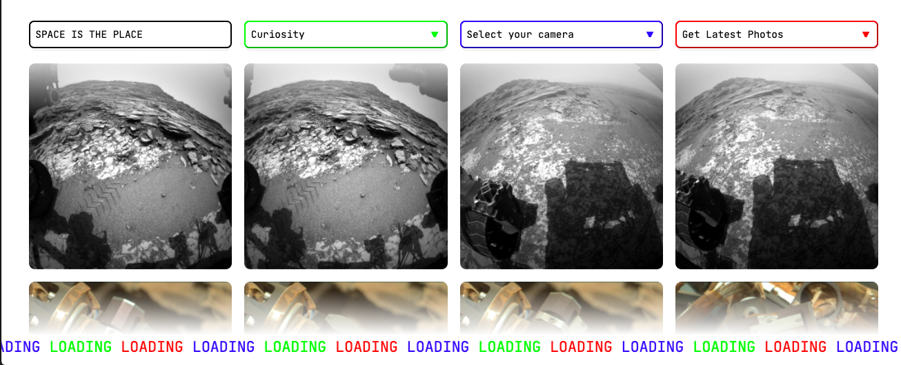
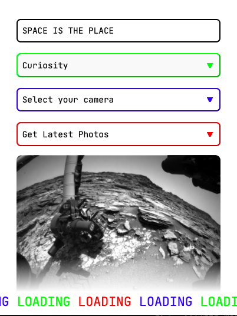
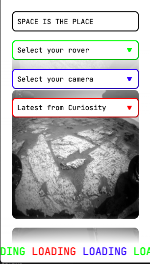
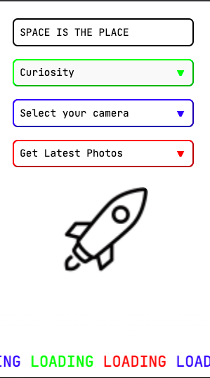

# Space is the place 🛰

## User Journey

This app displays images fetched from the [NASA Mars Rover Photos API](https://data.nasa.gov/Space-Science/Mars-Rover-Photos-API/929k-jizu)

The images are gathered by NASA's Curiosity, Opportunity, and Spirit rovers on Mars.

This is a one page app with desktop:

and mobile views:

The user can choose on the drop down menus from any of the three rovers on Mars:

🪐 Curiosity

🪐 Spirit

🪐 Opportunity

and between two cameras:

📷 Front Hazard

📷 Rear Hazard

The Get Latest Photos option fetches the latest images from the main Curiosity rover:

The rocket animation lets the user know that the images are loading:

